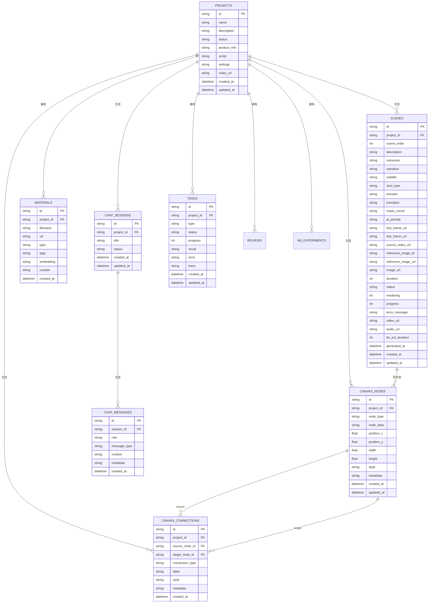

# 数据库表结构文档

## 📋 概述

本文档记录了 AIGC 视频生成项目的数据库表结构设计。

**数据库类型**: SQLite  
**最后更新**: 2026-05-24

---

## 🔗 E-R 关系图



### 关系说明

| 关系 | 说明 | 基数 |
|------|------|------|
| `PROJECTS → SCENES` | 项目包含多个分镜 | 1:N |
| `PROJECTS → MATERIALS` | 项目拥有多个素材 | 1:N |
| `PROJECTS → CANVAS_NODES` | 项目包含多个画布节点 | 1:N |
| `PROJECTS → CANVAS_CONNECTIONS` | 项目包含多个连接 | 1:N |
| `PROJECTS → CHAT_SESSIONS` | 项目包含多个会话 | 1:N |
| `PROJECTS → TASKS` | 项目拥有多个任务 | 1:N |
| `PROJECTS → REVIEWS` | 项目拥有多个审核 | 1:N |
| `PROJECTS → AB_EXPERIMENTS` | 项目包含多个实验 | 1:N |
| `SCENES → CANVAS_NODES` | 分镜同步到画布节点 | 1:1 |
| `CANVAS_NODES → CANVAS_CONNECTIONS` | 节点参与多个连接 | 1:N |
| `CHAT_SESSIONS → CHAT_MESSAGES` | 会话包含多条消息 | 1:N |

---

## 📊 表清单

| 表名 | 说明 | 核心字段数 |
|------|------|-----------|
| [projects](#projects-表) | 项目表 | 10 |
| [scenes](#scenes-表) | 分镜表 | 29 |
| [materials](#materials-表) | 素材表 | 8 |
| [canvas_nodes](#canvas_nodes-表) | 画布节点表 | 11 |
| [canvas_connections](#canvas_connections-表) | 画布连接表 | 6 |
| [chat_sessions](#chat_sessions-表) | 聊天会话表 | 5 |
| [chat_messages](#chat_messages-表) | 聊天消息表 | 7 |

---

## 📁 projects 表

### 表说明
存储项目的基本信息，包括项目名称、描述、状态等。

### 表结构

```sql
CREATE TABLE projects (
  id TEXT PRIMARY KEY,
  name TEXT NOT NULL,
  description TEXT,
  status TEXT DEFAULT 'draft',
  product_info TEXT,
  script TEXT,
  settings TEXT,
  video_url TEXT,
  created_at DATETIME DEFAULT CURRENT_TIMESTAMP,
  updated_at DATETIME DEFAULT CURRENT_TIMESTAMP
);
```

### 字段说明

| 字段名 | 类型 | 默认值 | 说明 | 示例 |
|--------|------|--------|------|------|
| id | TEXT | - | 唯一标识符 | `proj_1779597714314_ra9nja` |
| name | TEXT | - | 项目名称 | `游戏广告` |
| description | TEXT | - | 项目描述 | `推广新上线的游戏` |
| status | TEXT | `draft` | 项目状态 | `draft/processing/completed` |
| product_info | TEXT | - | 产品信息（JSON） | `{"title":"游戏名","sellingPoints":"..."}` |
| script | TEXT | - | 剧本信息（JSON） | 包含 title 和 scenes 数组 |
| settings | TEXT | - | 项目设置（JSON） | 自定义配置 |
| video_url | TEXT | - | 最终视频URL | `https://...` |
| created_at | DATETIME | 当前时间 | 创建时间 | `2026-05-24T10:30:00` |
| updated_at | DATETIME | 当前时间 | 更新时间 | `2026-05-24T11:00:00` |

### status 状态值

| 状态值 | 说明 |
|--------|------|
| `draft` | 草稿状态 |
| `processing` | 处理中 |
| `completed` | 已完成 |

---

## 🎬 scenes 表

### 表说明
**核心表** - 存储每个项目的分镜信息，包括AI视频生成参数、渲染状态等。

### 表结构

```sql
CREATE TABLE scenes (
  id TEXT PRIMARY KEY,
  project_id TEXT NOT NULL,
  scene_order INTEGER NOT NULL DEFAULT 0,
  
  -- 基础内容
  description TEXT,
  voiceover TEXT,
  narration TEXT,
  subtitle TEXT,
  
  -- 视觉参数
  shot_type TEXT DEFAULT '中景',
  emotion TEXT DEFAULT '积极',
  transition TEXT DEFAULT 'fade',
  music_mood TEXT DEFAULT '无',
  
  -- AI生成控制 ⭐ 新增
  ai_prompt TEXT,
  first_frame_url TEXT,
  last_frame_url TEXT,
  source_video_url TEXT,
  
  -- 素材引用
  reference_image_id TEXT,
  reference_image_url TEXT,
  image_url TEXT,
  
  -- 渲染状态
  duration INTEGER DEFAULT 5,
  status TEXT DEFAULT 'idle',
  rendering INTEGER DEFAULT 0,
  progress INTEGER DEFAULT 0,
  error_message TEXT,
  
  -- 生成结果
  video_url TEXT,
  audio_url TEXT,
  tts_est_duration INTEGER,
  
  -- 元数据
  generated_at DATETIME,
  created_at DATETIME DEFAULT CURRENT_TIMESTAMP,
  updated_at DATETIME DEFAULT CURRENT_TIMESTAMP,
  
  FOREIGN KEY (project_id) REFERENCES projects(id) ON DELETE CASCADE
);
```

### 字段说明

#### 🔹 核心标识字段

| 字段名 | 类型 | 默认值 | 说明 | 示例 |
|--------|------|--------|------|------|
| id | TEXT | - | 唯一标识符 | `scene_proj_xxx_1_12345` |
| project_id | TEXT | - | 所属项目ID | `proj_1779597714314_ra9nja` |
| scene_order | INTEGER | 0 | 分镜顺序 | `1, 2, 3...` |

#### 🔹 基础内容字段

| 字段名 | 类型 | 默认值 | 说明 | 示例 |
|--------|------|--------|------|------|
| description | TEXT | - | 画面描述（AI提示词） | `年轻人窝在沙发上玩手机...` |
| voiceover | TEXT | - | 旁白文案（TTS配音） | `还在刷手机刷到无聊吗？` |
| narration | TEXT | - | 备用旁白 | 备用的旁白内容 |
| subtitle | TEXT | - | 字幕文案 | `点击下载立即开玩` |

#### 🔹 视觉参数字段

| 字段名 | 类型 | 默认值 | 说明 | 可选值 |
|--------|------|--------|------|--------|
| shot_type | TEXT | `中景` | 镜头类型 | `特写/近景/中景/全景/远景/俯拍/仰拍/航拍/移动镜头` |
| emotion | TEXT | `积极` | 情感基调 | `积极/专业/热情/平静/紧张/轻松/浪漫/神秘` |
| transition | TEXT | `fade` | 转场效果 | `none/fade/wipe/dissolve/zoom` |
| music_mood | TEXT | `无` | 配乐氛围 | `无/轻快/舒缓/动感/紧张/浪漫/史诗` |

#### 🔹 AI生成控制字段 ⭐

| 字段名 | 类型 | 默认值 | 说明 | 示例 |
|--------|------|--------|------|------|
| ai_prompt | TEXT | - | AI生图提示词（英文） | `young person on sofa, bored...` |
| first_frame_url | TEXT | - | ⭐首帧图片URL | `https://.../first.jpg` |
| last_frame_url | TEXT | - | ⭐尾帧图片URL | `https://.../last.jpg` |
| source_video_url | TEXT | - | 源视频素材URL | 已有视频素材链接 |

#### 🔹 素材引用字段

| 字段名 | 类型 | 默认值 | 说明 | 示例 |
|--------|------|--------|------|------|
| reference_image_id | TEXT | - | 参考图片素材库ID | `mat_123456` |
| reference_image_url | TEXT | - | 参考图片URL | `https://...` |
| image_url | TEXT | - | AI生成的图片URL | `https://...` |

#### 🔹 渲染状态字段

| 字段名 | 类型 | 默认值 | 说明 | 示例 |
|--------|------|--------|------|------|
| duration | INTEGER | `5` | 预计时长（秒） | `4, 5, 10` |
| status | TEXT | `idle` | 渲染状态 | 见下方状态值 |
| rendering | INTEGER | `0` | 是否渲染中 | `0=否, 1=是` |
| progress | INTEGER | `0` | 渲染进度 | `0-100` |
| error_message | TEXT | - | 错误信息 | `API调用失败...` |

**status 状态值：**

| 状态值 | 说明 |
|--------|------|
| `idle` | 空闲/待生成 |
| `pending` | 等待中 |
| `generating` | 生成中 |
| `completed` | 已完成 |
| `failed` | 失败 |

#### 🔹 生成结果字段

| 字段名 | 类型 | 默认值 | 说明 | 示例 |
|--------|------|--------|------|------|
| video_url | TEXT | - | AI生成的视频URL | `https://.../video.mp4` |
| audio_url | TEXT | - | 音频URL（TTS配音） | `https://.../audio.mp3` |
| tts_est_duration | INTEGER | - | TTS预计时长（秒） | `5` |

#### 🔹 元数据字段

| 字段名 | 类型 | 默认值 | 说明 | 示例 |
|--------|------|--------|------|------|
| generated_at | DATETIME | - | 生成时间 | `2026-05-24T10:30:00` |
| created_at | DATETIME | 当前时间 | 创建时间 | - |
| updated_at | DATETIME | 当前时间 | 更新时间 | - |

### 索引

```sql
CREATE INDEX idx_scenes_project ON scenes(project_id);
CREATE INDEX idx_scenes_order ON scenes(project_id, scene_order);
CREATE INDEX idx_scenes_status ON scenes(status);
```

---

## 📷 materials 表

### 表说明
存储素材库中的素材信息，包括图片、视频、音频等。

### 表结构

```sql
CREATE TABLE materials (
  id TEXT PRIMARY KEY,
  project_id TEXT,
  filename TEXT NOT NULL,
  url TEXT NOT NULL,
  type TEXT,
  tags TEXT,
  embedding TEXT,
  content TEXT,
  created_at DATETIME DEFAULT CURRENT_TIMESTAMP,
  FOREIGN KEY (project_id) REFERENCES projects(id) ON DELETE CASCADE
);
```

### 字段说明

| 字段名 | 类型 | 说明 | 示例 |
|--------|------|------|------|
| id | TEXT | 唯一标识符 | `mat_123456` |
| project_id | TEXT | 关联项目ID | `proj_xxx` |
| filename | TEXT | 文件名 | `product.jpg` |
| url | TEXT | 素材URL | `https://...` |
| type | TEXT | 素材类型 | `image/video/audio` |
| tags | TEXT | 标签（JSON数组） | `["商品","高清"]` |
| embedding | TEXT | 向量嵌入 | 用于语义搜索 |
| content | TEXT | 素材描述 | `商品展示图` |
| created_at | DATETIME | 创建时间 | - |

---

## 🎨 canvas_nodes 表

### 表说明
存储画布上的节点信息，用于可视化工作流。

### 表结构

```sql
CREATE TABLE canvas_nodes (
  id TEXT PRIMARY KEY,
  project_id TEXT NOT NULL,
  node_type TEXT NOT NULL,
  node_data TEXT NOT NULL,
  position_x REAL NOT NULL,
  position_y REAL NOT NULL,
  width REAL DEFAULT 200,
  height REAL DEFAULT 150,
  style TEXT,
  metadata TEXT,
  created_at DATETIME DEFAULT CURRENT_TIMESTAMP,
  updated_at DATETIME DEFAULT CURRENT_TIMESTAMP,
  FOREIGN KEY (project_id) REFERENCES projects(id) ON DELETE CASCADE
);
```

### 字段说明

| 字段名 | 类型 | 说明 |
|--------|------|------|
| id | TEXT | 节点唯一ID |
| project_id | TEXT | 所属项目ID |
| node_type | TEXT | 节点类型（script/scene/material/video/intent/plan/operation） |
| node_data | TEXT | 节点数据（JSON） |
| position_x | REAL | X坐标 |
| position_y | REAL | Y坐标 |
| width | REAL | 节点宽度 |
| height | REAL | 节点高度 |
| style | TEXT | 样式配置（JSON） |
| metadata | TEXT | 元数据（JSON） |

### 索引

```sql
CREATE INDEX idx_canvas_nodes_project ON canvas_nodes(project_id);
CREATE INDEX idx_canvas_nodes_type ON canvas_nodes(node_type);
```

---

## 🔗 canvas_connections 表

### 表说明
存储画布上节点之间的连接关系。

### 表结构

```sql
CREATE TABLE canvas_connections (
  id TEXT PRIMARY KEY,
  project_id TEXT NOT NULL,
  source_node_id TEXT NOT NULL,
  target_node_id TEXT NOT NULL,
  connection_type TEXT NOT NULL,
  label TEXT,
  style TEXT,
  metadata TEXT,
  created_at DATETIME DEFAULT CURRENT_TIMESTAMP,
  FOREIGN KEY (project_id) REFERENCES projects(id) ON DELETE CASCADE,
  FOREIGN KEY (source_node_id) REFERENCES canvas_nodes(id) ON DELETE CASCADE,
  FOREIGN KEY (target_node_id) REFERENCES canvas_nodes(id) ON DELETE CASCADE
);
```

### connection_type 连接类型

| 类型 | 说明 | 示例 |
|------|------|------|
| `timeline` | 时间线连接 | 剧本 → 分镜 |
| `dependency` | 依赖关系 | 分镜 → 视频 |
| `reference` | 引用关系 | 素材引用 |
| `operation` | 操作关系 | 操作节点连接 |

### 索引

```sql
CREATE INDEX idx_connections_project ON canvas_connections(project_id);
CREATE INDEX idx_connections_source ON canvas_connections(source_node_id);
CREATE INDEX idx_connections_target ON canvas_connections(target_node_id);
```

---

## 💬 chat_sessions 表

### 表说明
存储用户的聊天会话记录。

### 表结构

```sql
CREATE TABLE chat_sessions (
  id TEXT PRIMARY KEY,
  project_id TEXT NOT NULL,
  title TEXT,
  status TEXT DEFAULT 'active',
  created_at DATETIME DEFAULT CURRENT_TIMESTAMP,
  updated_at DATETIME DEFAULT CURRENT_TIMESTAMP,
  FOREIGN KEY (project_id) REFERENCES projects(id) ON DELETE CASCADE
);
```

---

## 💬 chat_messages 表

### 表说明
存储聊天消息内容。

### 表结构

```sql
CREATE TABLE chat_messages (
  id TEXT PRIMARY KEY,
  session_id TEXT NOT NULL,
  role TEXT NOT NULL,
  message_type TEXT DEFAULT 'text',
  content TEXT NOT NULL,
  metadata TEXT,
  created_at DATETIME DEFAULT CURRENT_TIMESTAMP,
  FOREIGN KEY (session_id) REFERENCES chat_sessions(id) ON DELETE CASCADE
);
```

### 字段说明

| 字段名 | 类型 | 说明 | 可选值 |
|--------|------|------|--------|
| id | TEXT | 消息ID | - |
| session_id | TEXT | 会话ID | - |
| role | TEXT | 角色 | `user/assistant/system` |
| message_type | TEXT | 消息类型 | `text/image/tool_call/operation_log/error` |
| content | TEXT | 消息内容 | - |

---

## 📈 数据库关系图

```
┌──────────────┐
│  projects    │
│──────────────│
│ id (PK)      │
│ name         │
│ status       │
│ script       │
│ video_url    │
└──────┬───────┘
       │
       │ 1:N
       ├──────────┬────────────┬────────────┐
       │          │            │            │
       ▼          ▼            ▼            ▼
┌──────────┐  ┌────────┐  ┌──────────┐  ┌──────────────┐
│ scenes   │  │materials│ │canvas_nodes│ │chat_sessions │
│──────────│  │────────│  │──────────│  │──────────────│
│ id (PK)  │  │ id(PK) │  │ id (PK)  │  │ id (PK)      │
│ project_  │  │project │  │ project_  │  │ project_id   │
│ id (FK)  │  │_id(FK) │  │ id (FK)  │  │ id (FK)      │
│ scene_order│  │filename │  │ node_type │  │ title        │
│ description│  │url      │  │ node_data │  │ status       │
│ voiceover │  │type     │  │ position  │  └──────────────┘
│ first_frame│  │tags     │  └─────┬──────┘
│ last_frame │  └────────┘        │
│ video_url  │                   │ 1:N
│ status     │                   ▼
└────────────┘          ┌───────────────┐
                        │canvas_       │
                        │connections   │
                        │──────────────│
                        │ id (PK)      │
                        │ source_node  │
                        │ target_node  │
                        │ type         │
                        └───────────────┘
```

---

## 📝 注意事项

### scenes 表扩展性
- ✅ 支持 AI 视频生成的首尾帧控制
- ✅ 支持多种镜头类型和情感基调
- ✅ 支持渲染进度实时跟踪
- ✅ 支持错误信息记录

### 性能优化
- ✅ 为常用查询创建了索引
- ✅ 使用外键约束保证数据完整性
- ✅ 支持级联删除

### 兼容性
- ✅ 所有字段名使用下划线命名（snake_case）
- ✅ 时间字段统一使用 ISO 8601 格式
- ✅ JSON 字段便于扩展

---

## 🔄 迁移历史

### 2026-05-24 - 添加 scenes 表
- 创建独立的 `scenes` 表存储分镜信息
- 支持首尾帧控制（`first_frame_url`, `last_frame_url`）
- 从 `projects.script` JSON 字段迁移数据

---

## 👤 维护者

**最后更新**: 2026-05-24  
**更新人**: AI Assistant

---

**文档版本**: v1.1
